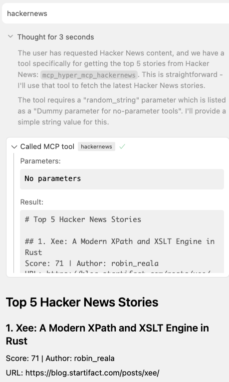

# Hacker News Plugin

A [hyper-mcp](https://github.com/tuananh/hyper-mcp) plugin that fetches the top 5 stories from Hacker News.
<p align="center">
  
</p>
## Overview

This plugin connects to the Hacker News API to fetch the current top stories and display them with their titles, scores, authors, and URLs.

## Usage

Add the plugin to your hyper-mcp configuration:
can be oci://ghcr.io/hungran/hyper-mcp-hackernews-tool.wasm
or wasi path file plugin.wasm
```json
{
  "plugins": [
    {
      "name": "hackernews",
      "path": "oci://ghcr.io/hungran/hyper-mcp-hackernews-tool:latest",
      "runtime_config": {
        "allowed_host": "hacker-news.firebaseio.com"
      }
    }
  ]
}
```

The `allowed_host` configuration must include `*` or specifically `hacker-news.firebaseio.com` to allow API requests.

## Building

To build the plugin:

```bash
# Make sure build.sh is executable
chmod +x build.sh

# Run the build script
./build.sh
```

This will create a `plugin.wasm` file that can be referenced in your hyper-mcp configuration.

## API

The plugin requires a simple dummy parameter:

```json
{
  "random_string": "any_value"
}
```

## Example Usage

From the terminal:

```bash
echo '{ "jsonrpc": "2.0", "id": 1, "method": "tools/call", "params": { "name": "hackernews", "arguments": { "random_string": "dummy" } } }' | hyper-mcp
```

## Output

The plugin returns a formatted list of the top 5 stories from Hacker News, including:

- Title
- Score
- Author
- URL (if available)

## Dependencies

- github.com/extism/go-pdk v1.1.3
- github.com/tidwall/gjson v1.17.1 